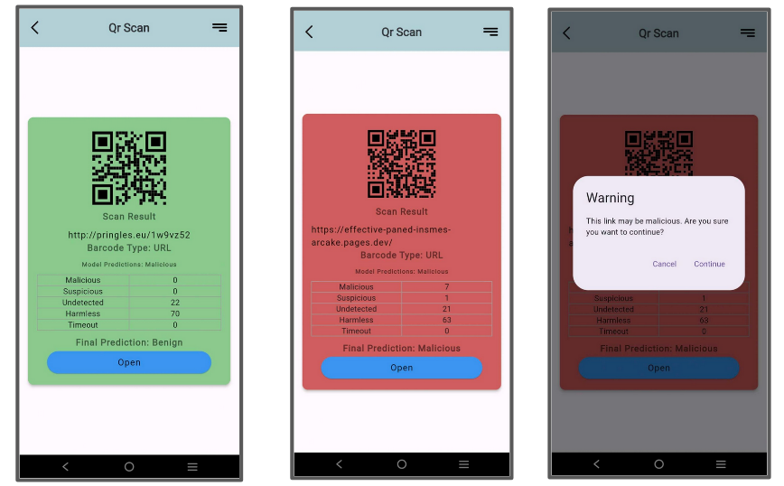
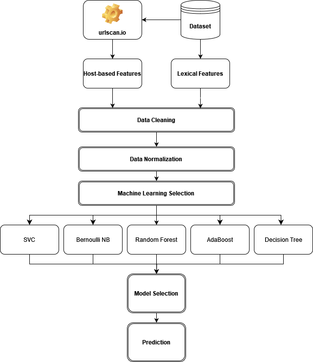

# Safe QR Scanner
A flutter-based mobile application which has a malicious link detection feature using current existing blacklist APIs and our own machine learning model.

  
  

The application provides:
- basic camera functionality
- Full QR code details, including:
    - Type
    - Analysis report from other vendors
    - Final prediction

---

### AI model
For the training of my own model, I have mainly selected 2 types of features :

Lexical-Based Features

  
| No  | Feature                     | Description                                                                                     |
|-----|-----------------------------|-------------------------------------------------------------------------------------------------|
| 1   | Total URL length            | Length of the entire URL, without counting the scheme                                           |
| 2   | netloc length               | Length of the network location part of the URL                                                 |
| 3   | Query Length                | Length of the query string in the URL                                                          |
| 4   | count digits                | Counts the number of digits in the URL                                                         |
| 5   | count reserved char         | Counts the number of reserved characters in the URL                                            |
| 6   | has https                   | Whether the site uses HTTPS                                                                    |
| 7   | Country Code TLD            | Determines the country of origin based on the top-level domain (TLD) of the URL               |
| 8   | is shortened TLD            | Whether the domain is a known URL shortening service                                           |
| 9   | has Port                    | Whether a port is specified in the URL                                                        |
| 10  | has username                | Whether a username is included in the URL                                                     |
| 11  | has fragments               | Whether fragments are present in the URL                                                      |
| 12  | num queries                 | Counts the number of queries in the URL, done by counting `&`                                  |
| 13  | URL encoding                | Counts the number of URL-encoded characters in the URL, done by counting `%`                  |
| 14  | Path length                 | Length of the path component in the URL                                                       |
| 15  | Path depth                  | Number of segments in the path of the URL, counts the number of `\`                           |
| 16  | Path digit counts           | Counts the number of digits in the path component of the URL                                   |
| 17  | Path special character count| Counts the number of special characters in the path component of the URL                       |
| 18  | has exe or php              | Whether the path ends with the file format `.php` or `.exe`                                    |

Host-Based Features

  
| No  | Feature           | Description                                        |
|-----|-----------------|----------------------------------------------------|
| 19  | Page title       | If it has a title for the webpage                 |
| 20  | mimeType         | If it has anything else other than text/html      |
| 21  | redirected       | Indicates if the webpage was redirected           |
| 22  | ranking          | Ranking of the webpage based on Cisco             |
| 23  | country          | Country in which the server is deployed          |
| 24  | tlsValidDays     | Validity period of the TLS certificate           |
| 25  | numRequest       | Number of HTTP requests made                      |
| 26  | num Links        | Number of hyperlinks present                      |
| 27  | num Cookies      | Number of cookies set                             |
| 28  | num Console Msg  | Number of console messages                        |

This is then trained on a dataset gathered from OpenPhish and CloudFlare, with the following procedure :

  

*note: Dataset only stores live site (at that time), as it needs to collect WHOIS data, and a live search up*

With the result <u>**Naive Bayes**</u> was chosen as the model. 

Results

  
| Classifier               | Accuracy  | Recall    | Precision | F1-Score  |
|--------------------------|----------|----------|-----------|-----------|
| BernoulliNB              | 0.941234 | 0.939876 | 0.942512  | 0.941101  |
| RandomForestClassifier   | 0.923456 | 0.920987 | 0.924823  | 0.922954  |
| AdaBoostClassifier       | 0.912743 | 0.910321 | 0.914256  | 0.911743  |
| DecisionTreeClassifier   | 0.897412 | 0.895123 | 0.898945  | 0.896987  |
| SVC                      | 0.861351 | 0.861351 | 0.880575  | 0.797190  |

---

